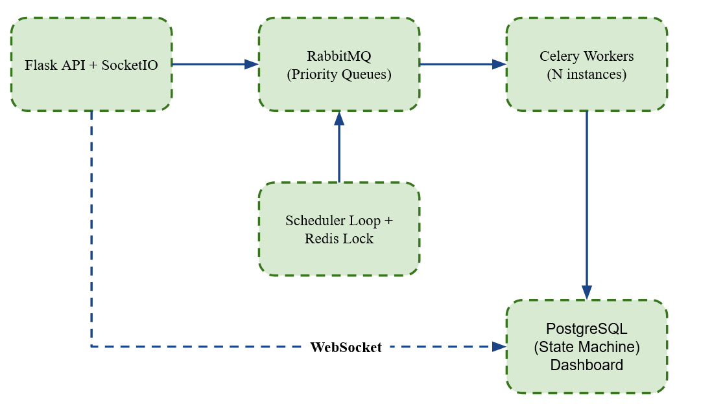

# Distributed Job Scheduler

A production-grade distributed job scheduling and execution engine built with Flask, Celery, RabbitMQ, Redis, and PostgreSQL.

---

## Architecture Overview



The system has 4 main processes:
- **API** — Flask REST API + WebSocket server for the dashboard
- **Scheduler Loop** — separate process that polls PostgreSQL every 10s, identifies due jobs, and enqueues them
- **Workers** — Celery workers that consume jobs from RabbitMQ and execute them
- **Dashboard** — real-time monitoring UI updated via WebSocket push


## Quick Start

### Prerequisites
- Docker Desktop
- Git

### Run with Docker

```bash
git clone 
cd scheduler
cp .env.example .env
docker-compose up --build
```

Open `http://localhost:5000` for the dashboard.
The dashboard interface can be seen in the screenshot below:


### Scale workers

```bash
docker-compose up --scale worker=3
```

### Run locally (development)

```bash
# Start infrastructure only
docker-compose up -d postgres redis rabbitmq

# Install dependencies
python -m venv venv
venv\Scripts\activate  # Windows
pip install -r requirements.txt

# Terminal 1 — API
python run.py

# Terminal 2 — Worker
celery -A app.tasks.celery_app.celery_app worker --loglevel=info -Q high,normal,low --pool=solo

# Terminal 3 — Scheduler
python -m app.scheduler.loop
```

---


## API Reference

### Jobs

| Method | Endpoint | Description |
|--------|----------|-------------|
| GET | `/jobs` | List all jobs (filter: `?status=active`) |
| POST | `/jobs` | Create a job |
| GET | `/jobs/<id>` | Get job by ID |
| PUT | `/jobs/<id>` | Update job |
| POST | `/jobs/<id>/pause` | Pause job |
| POST | `/jobs/<id>/resume` | Resume job |
| POST | `/jobs/<id>/archive` | Archive job |
| POST | `/jobs/<id>/trigger` | Manually trigger immediately |

### Dependencies

| Method | Endpoint | Description |
|--------|----------|-------------|
| GET | `/jobs/<id>/dependencies` | Get job dependencies |
| POST | `/jobs/<id>/dependencies` | Add dependency |
| DELETE | `/jobs/<id>/dependencies/<dep_id>` | Remove dependency |

### Health Checks

| Method | Endpoint | Description |
|--------|----------|-------------|
| GET | `/health/api` | API health |
| GET | `/health/worker` | Worker health |
| GET | `/health/scheduler` | Scheduler health |

### Create Job Example

```json
POST /jobs
{
    "name": "daily-report",
    "job_type": "report",
    "schedule_type": "periodic",
    "cron_expression": "0 9 * * *",
    "priority": "high",
    "max_retries": 3,
    "max_execution_time": 300,
    "max_concurrency": 1,
    "failure_threshold": 0.5,
    "alert_webhook": "https://hooks.slack.com/..."
}
```

---

## Job Lifecycle (State Machine)

```
PENDING → QUEUED → RUNNING → SUCCESS
                           → FAILED → (retry?) → QUEUED
                                               → DEAD LETTER
                           → TIMEOUT → (retry?) → QUEUED
                                                → DEAD LETTER
```

State transitions are enforced in the service layer via `is_valid_transition()`. Invalid transitions are rejected — a job can never go from `SUCCESS` back to `RUNNING`.

---

## Key Design Decisions

### Why croniter instead of manual cron parsing?

`croniter` correctly handles edge cases that manual parsers commonly get wrong — `@monthly`, `@weekly` shorthands, leap years, and DST transitions. The tradeoff is an external dependency, but reliability of schedule evaluation outweighs the cost.

### Why RabbitMQ instead of Redis as the queue?

RabbitMQ has native priority queue support and a proper Dead Letter Queue mechanism built in. Redis can do this but requires custom implementation. For a system where job priority and failure handling are core requirements, RabbitMQ is the right tool.

### Why PostgreSQL for job state instead of Redis?

Durability. Redis can lose data on restart without persistence configuration. Job execution history must survive crashes — PostgreSQL with ACID guarantees is the correct choice for state that matters.

### Why a custom scheduler loop instead of Celery Beat?

Celery Beat is a black box — it doesn't support our custom state machine, dependency checking, or distributed locking. Our scheduler loop gives full control over when and how jobs are enqueued, and allows the DAG dependency check before each enqueue.

### Layered Architecture

```
API Layer (routes.py)          — HTTP in/out only
Service Layer (job_service.py) — business logic
Data Layer (models/)           — SQLAlchemy models
```

This separation means business logic is testable without HTTP, and database models are independent of API design.

---

## Exactly-Once Execution Guarantee

Preventing duplicate execution in a distributed system requires two layers:

**Layer 1 — Redis SETNX on the scheduler:**
```python
redis.set("scheduler:master_lock", "1", nx=True, ex=30)
```
Only one scheduler instance can run the scheduling cycle at a time. TTL of 30 seconds means the lock auto-expires if the scheduler crashes.

**Layer 2 — PostgreSQL SELECT FOR UPDATE on the worker:**
```python
db.query(JobInstance).filter(...).with_for_update()
```
When a worker claims an instance, it locks the row at database level. A second worker receiving the same task ID will find the row already transitioned past `QUEUED` and exit cleanly.

**Edge case — network partition:**
If a worker acquires the DB lock, transitions the job to `RUNNING`, then loses network connectivity before completing — the job stays in `RUNNING` state indefinitely. Mitigation: a separate watchdog process (future improvement) could detect instances stuck in `RUNNING` beyond `max_execution_time` and transition them to `TIMEOUT`.

---

## Retry Logic

Exponential backoff with jitter as specified:

```python
delay = 2**attempt + random(0, 1)  # seconds
```

**Why jitter?** Without it, if 100 jobs fail simultaneously they all retry at the same moment — a thundering herd that overwhelms the system. Jitter spreads retries across a window of time.

After `max_retries` exhausted, the instance moves to the Dead Letter Queue with full error context preserved for inspection.

---

## DAG Dependencies

Job B can depend on Job A — B only runs after A completes with `SUCCESS`.

**Cycle detection** runs at definition time using Depth First Search (DFS). If adding a dependency would create a cycle, it is rejected before saving:

```
A → B → C, attempt to add C → A:
DFS from A: visits B → C → would visit A → CYCLE DETECTED → rejected
```

Failing at definition time gives a clear error message. A cycle discovered at execution time would cause jobs to wait forever silently.

---


## Running Tests

```bash
python -m pytest tests/ -v
```
